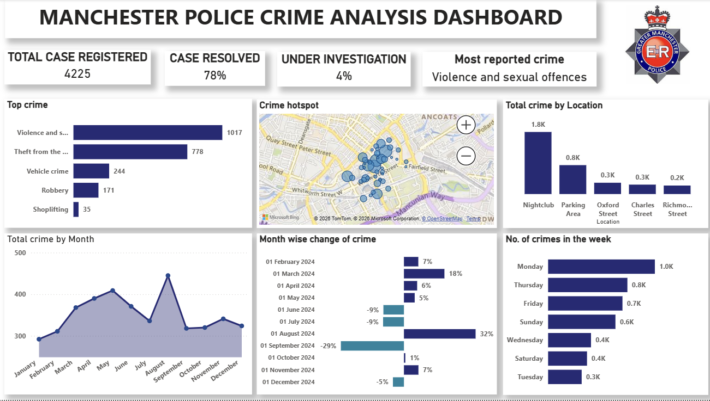

# Manchester Police Crime Analysis Dashboard

## Project Overview

The **Manchester Police Crime Analysis Dashboard** is an interactive Business Intelligence project developed using **Microsoft Power BI**. The project focuses on analyzing crime data and transforming a large volume of records into meaningful insights through interactive visualizations, KPI cards, and advanced DAX calculations.

The dashboard analyzes **4,225 crime cases** and provides a comprehensive view of crime patterns, case outcomes, investigation status, location-based trends, monthly performance, and other key indicators.

The primary goal of this project is to demonstrate how raw data can be transformed into a structured, interactive, and visually engaging dashboard that supports effective analysis and data-driven decision-making.

---

# Dashboard Preview




---

# Project Objectives

The main objectives of this project are to:

- Analyze overall crime patterns and trends.
- Monitor the total number of registered crime cases.
- Compare current month performance with the previous month.
- Identify Month-over-Month changes in crime activity.
- Analyze crime outcomes and investigation status.
- Measure case resolution and overall efficiency.
- Identify high-crime locations and crime categories.
- Analyze crime trends across different days and months.
- Identify the most significant categories and locations using Dynamic Top N analysis.
- Transform complex crime data into actionable and easy-to-understand insights.

---

# Dashboard Highlights

| KPI | Value |
|---|---:|
| Total Cases Registered | **4,225** |
| Case Resolution Rate | **78%** |
| Cases Under Investigation | **4%** |
| Most Reported Crime | **Violence and Sexual Offences** |
| Cases in Top Crime Category | **1,017** |
| Highest Crime Location | **Nightclub Area** |
| Cases in Top Location | **1.8K** |
| Highest Crime Day | **Monday** |
| Cases on Highest Crime Day | **1.0K** |
| Peak Crime Month | **August** |
| Peak Monthly Cases | **Approximately 445** |
| Highest MoM Increase | **August – 32%** |
| Highest MoM Decrease | **September – 29%** |

---

# Key Analysis Performed

## Total Crime Analysis

Analyzed the overall volume of registered crime cases to understand the scale of crime activity and establish a foundation for further analysis.

**Total Cases Analyzed: 4,225**

---

## Month-over-Month Analysis

Month-over-Month analysis was performed to compare crime activity between consecutive months.

This helps identify:

- Increasing crime trends.
- Decreasing crime trends.
- Significant monthly variations.
- Changes in crime patterns over time.

### Key Finding

- **August recorded the highest Month-over-Month increase of 32%.**
- **September recorded the highest Month-over-Month decrease of 29%.**

---

## Previous Month Crime Comparison

A previous month comparison was implemented to provide users with a quick understanding of how current crime activity compares with the previous reporting period.

This analysis helps monitor changes and identify unusual variations in crime volume.

---

## Crime Category Analysis

Crime categories were analyzed to identify the most frequently reported types of crime.

### Key Finding

**Violence and Sexual Offences** emerged as the most reported crime category, accounting for **1,017 cases**.

This highlights the importance of analyzing crime categories to understand which areas contribute significantly to the overall crime volume.

---

## Location Analysis

Location-based analysis was performed to identify areas with the highest concentration of reported crimes.

### Key Finding

The **Nightclub Area** recorded the highest crime activity, with approximately **1.8K cases**.

This insight can help identify crime hotspots and areas that require additional monitoring.

---

## Day-wise Crime Analysis

Crime activity was also analyzed across different days of the week to identify patterns in reporting.

### Key Finding

**Monday recorded the highest number of crime cases**, with approximately **1.0K cases**.

---

## Monthly Crime Trends

The dashboard tracks crime patterns across different months to identify periods of increased or decreased activity.

### Key Finding

**August was the peak crime month**, recording approximately **445 cases**.

---

# Investigation and Outcome Analysis

The dashboard also focuses on analyzing the current status and outcomes of reported crime cases.

Key areas include:

- Cases under investigation.
- Case outcomes.
- Case resolution performance.
- Updated and unavailable statuses.

### Key Findings

- **78% Case Resolution Rate**
- **4% Cases Currently Under Investigation**

These metrics provide an overview of investigation progress and case outcomes.

---

# Dynamic Top N Analysis

A Dynamic Top N feature was implemented to allow users to identify and analyze the highest-performing or most significant categories based on the selected criteria.

This feature improves dashboard interactivity and allows users to explore:

- Top crime categories.
- High-crime locations.
- Significant trends.
- Important data segments.

---

# DAX Measures Created

The dashboard includes several calculated measures developed using **DAX (Data Analysis Expressions)**.

Key measures include:

- Total Crime
- Level of Efficiency
- Month-over-Month (MoM)
- Previous Month Crime
- Under Investigation
- Outcome Analysis
- Status Updated / Unavailable
- Dynamic Top N

These measures enable dynamic calculations and provide deeper insights into the dataset.

---

# Key Insights

The analysis generated several important insights:

- **4,225 crime cases** were analyzed in the dashboard.
- **Violence and Sexual Offences** was the most reported crime category, with **1,017 cases**.
- The **Nightclub Area** recorded the highest crime activity, with approximately **1.8K cases**.
- **Monday** recorded the highest number of reported crimes, with approximately **1.0K cases**.
- **August** experienced the highest Month-over-Month increase of **32%**.
- **September** recorded the largest Month-over-Month decrease of **29%**.
- The dashboard achieved a **78% case resolution rate**.
- Only **4% of cases were currently under investigation**.

---

# Tools and Technologies

The following tools and technologies were used to develop this project:

### Microsoft Power BI

Used for data analysis, dashboard development, and interactive data visualization.

### DAX

Used to create calculated measures, KPIs, time intelligence calculations, and dynamic analysis.

### Data Modeling

Used to organize and structure the data for efficient analysis.

### Time Intelligence

Used for:

- Month-over-Month comparison.
- Previous month calculations.
- Monthly trend analysis.

---

# Skills Demonstrated

This project demonstrates practical skills in:

- Data Analysis
- Microsoft Power BI
- DAX
- Data Modeling
- Data Transformation
- Time Intelligence
- KPI Development
- Interactive Dashboard Design
- Data Visualization
- Analytical Thinking
- Data Storytelling
- Business Intelligence

---

# Repository Structure

```text
Manchester-Police-Crime-Analysis-Power-BI/
│
├── Manchester Police Crime Analysis Dashboard.pbix
│
├── README.md
│
└── dashboard-insights.png
│
└── dashboard-overview.png
```

# How to Use This Project

1. Download or clone this repository.
2. Open the `.pbix` file using **Microsoft Power BI Desktop**.
3. Explore the interactive dashboard.
4. Use the available filters and slicers to analyze different aspects of the crime data.
5. Review the KPIs, trends, investigation status, outcomes, and Dynamic Top N analysis.

---

# Project Outcome

This project demonstrates how **Business Intelligence tools can transform raw and complex data into meaningful insights**.

By combining **Power BI, DAX, data modeling, time intelligence, and interactive visualizations**, the dashboard provides a clear and structured view of crime patterns and performance indicators.

The final dashboard enables users to:

- Identify important crime trends.
- Monitor changes in monthly crime activity.
- Analyze investigation and case outcomes.
- Identify major crime hotspots.
- Understand high-volume crime categories.
- Explore data interactively.
- Support better data-driven decision-making.

---

# Future Improvements

Potential future improvements for this project include:

- Adding geographical maps for advanced crime hotspot analysis.
- Implementing drill-through pages for detailed investigation.
- Adding predictive analytics for future crime trend forecasting.
- Integrating real-time or regularly updated crime datasets.
- Adding more advanced KPI comparisons.
- Implementing additional filters and dynamic parameters.
- Creating automated reporting features.

---

# Author

**Raj Singh**

Aspiring Data Analyst | Power BI | Data Analysis | DAX | Data Visualization

---

## Connect With Me

If you found this project interesting, feel free to connect with me or reach out.

- LinkedIn: [Raj Singh](https://www.linkedin.com/in/rajsingh1801/)
- Email: [sraj10278@gmail.com](mailto:sraj10278@gmail.com)

---

### Turning Raw Data into Meaningful Insights and Actionable Decisions.
